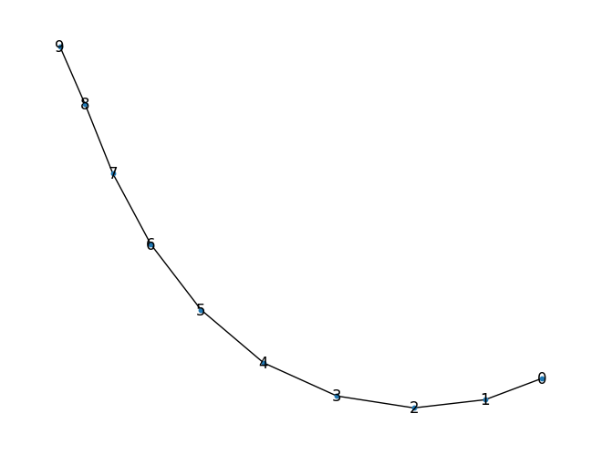

# x+1 is a list

Lets build graphs from functions. By graph, I don't mean graphic, by graph I mean the actual data structure.

For this purpose, imagine the following. I will grab a subset of a domain in $R$, namely $D$, for this subset I will create $N$ equidistant samples, this samples are going to be the nodes of my graph. The nodes of my graph are going to be connected in the following way.

- given $f(x): D \rightarrow D'$  with $ D' \subseteq D $, we build a graph with an adjacency matrix defined by $A_{ij}$
- the domain is divided in N intervals forming the enumerable finite set $\{ \min(D) + i \cdot h \ | \ i \in [0, N-1]\ \ \text{and} \ h := \frac{\max(D) - \min(D)}{N}\}$ where each element is denoted by $x_i$ respectively
- the graph contains $N$ nodes
- $A_{ij} = 1 \iff \argmin_{j'} \{L_{1}\left(f(x_i), x_{j'}\right)\} = j $


```python
def build_domain(min_d: float, max_d: float, N: int): return np.linspace(min_d, max_d, N)

def closest(fx, D: np.ndarray) -> int: return np.argmin(np.abs(fx-D))

def build_graph(min_d: float, max_d: float, N: int, fn: Callable[[float], float]) -> nx.Graph:
    D = build_domain(min_d, max_d, N)
    G = nx.Graph()
    for i, x in enumerate(D): G.add_node(i, x=x)
    for i, x in enumerate(D):
        if i == N-1: break
        G.add_edge(i, closest(fn(x), D))
    return G
```

with this setting $f(x) = x+1$ gives birth to a list


